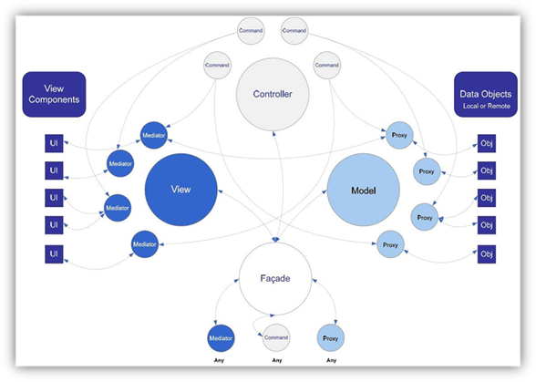

# pureMVC-

pureMVC是一个高度解耦的MVC框架，通过消息发布/订阅通知来进行每个模块之间的消息通信。

- 在PureMVC实现的经典MVC元设计模式中，M、V、C这三部分由三个单例模式类管理，分别是Model，View，Controller。这三者称为核心层或者核心角色，，另有一个单例模式类——Facade，Facade提供了与核心层通信的唯一接口，以简化开发复杂度。

出了上述之外，还有Mediator、Proxy、Command`(重点）`
- `Proxy`: Model 保存对 Proxy 对象的引用，Proxy 负责操作数据模型，与远程服务通信存取数据。

- `Mediator`: View 保存对 Mediator 对象的引用 。由 Mediator 对象来操作具体的视图组件，包括：添加事件监听器，发送或接收 Notification ，直接改变视图组件的状态。这样做实现了把视图和控制它的逻辑分离开来。

- `Command`: Controller 保存所有 Command 的映射。Command 类是无状态的，只在需要时才被创建。Command 可以获取 Proxy 对象并与之交互，发送 Notification，执行其他的 Command。

为了彻底解耦，避免直接的函数调用，PureMVC使用`观察者模式`（发布/订阅）的形式传递消息。

在实际应用中，通过Facade对Model、View、Controller注册一个或多个Proxy、Mediator、Command模块，每个模块包含多个处理核心层的功能，消息的发布/订阅由后者进行处理。

主要思想：

- 模型（Model）：“数据模型”（Model）用于封装与应用程序的业务逻辑相关的数据以及对数据的处理方法。“模型”有对数据直接访问的权力，例如对数据库的访问。“模型”不依赖“视图”和“控制器”，也就是说，模型不关心它会被如何显示或是如何被操作。但是模型中数据的变化一般会通过一种刷新机制被公布。为了实现这种机制，那些用于监视此模型的视图必须事先在此模型上注册，从而，视图可以了解在数据模型上发生的改变。（比较：观察者模式（软件设计模式））
- 视图（View）：视图层能够实现数据有目的的显示（理论上，这不是必需的）。在视图中一般没有程序上的逻辑。为了实现视图上的刷新功能，视图需要访问它监视的数据模型（Model），因此应该事先在被它监视的数据那里注册。
- 控制器（Controller）：控制器起到不同层面间的组织作用，用于控制应用程序的流程。它处理事件并作出响应。“事件”包括用户的行为和数据模型上的改变